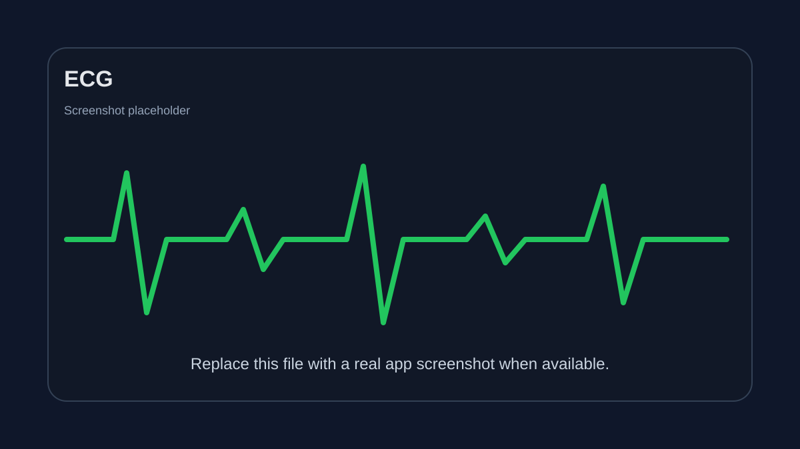

# ECG

A Python project for ECG-related work.

## Project Status

This repository currently contains an empty starter file, `ECG.py`. The project structure is ready for implementation, documentation, screenshots, and future ECG analysis or visualization features.

## Screenshots



## Requirements

- Python 3.10 or newer

## Getting Started

Clone the repository:

```bash
git clone git@github.com:AnnJo94/ECG.git
cd ECG
```

Run the Python file:

```bash
python ECG.py
```

## Project Structure

```text
ECG/
├── ECG.py
├── README.md
└── screenshots/
    └── placeholder.svg
```

## Notes

Add ECG processing, visualization, or analysis code to `ECG.py`, then replace the placeholder image in `screenshots/` with real application screenshots.
