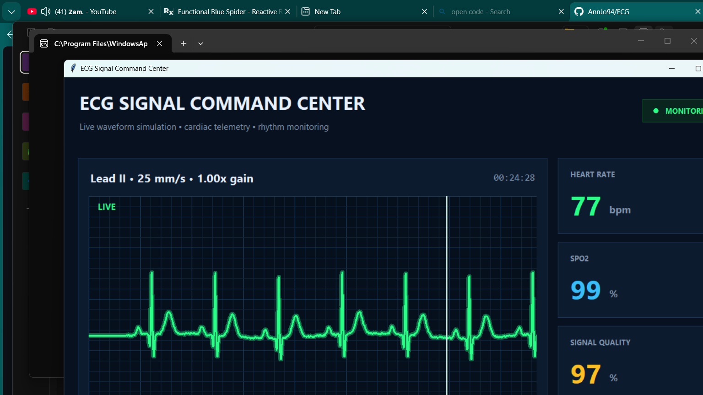

# ECG Signal Command Center

A browser-based ECG dashboard with live waveform rendering, telemetry cards, lead selection, gain controls, sweep speed controls, and patient data import for JSON or CSV files.

## Features

- Opens in a local webpage from `python ECG.py`
- Live animated ECG waveform simulation in Canvas
- Heart rate, SpO2, and signal quality telemetry cards
- Lead selector for standard ECG lead labels
- Adjustable waveform gain and sweep speed
- Pause/resume and reset controls
- Patient import for JSON and CSV files
- Imported ECG samples can replace the synthetic waveform
- Rhythm readout for monitoring states
- No third-party dependencies required

## Screenshots



## Requirements

- Python 3.10 or newer

## Getting Started

Clone the repository:

```bash
git clone git@github.com:AnnJo94/ECG.git
cd ECG
```

Run the local web dashboard:

```bash
python ECG.py
```

The app starts a local server and opens:

```text
http://localhost:8000/web/index.html
```

## Patient Import

Use the file picker in the dashboard to import `.json` or `.csv` patient data.

Example JSON:

```json
{
  "name": "Maya Joseph",
  "id": "ECG-2026-014",
  "age": 42,
  "sex": "Female",
  "diagnosis": "Post-exercise monitoring",
  "heartRate": 82,
  "spo2": 99,
  "signalQuality": 96,
  "lead": "Lead II",
  "notes": "Demo patient record",
  "samples": [0.02, 0.04, 0.08, 1.0, -0.3, 0.12]
}
```

Example CSV:

```csv
name,id,age,sex,diagnosis,heartRate,spo2,signalQuality,lead,notes,samples
Maya Joseph,ECG-2026-014,42,Female,Post-exercise monitoring,82,99,96,Lead II,Demo patient record,"0.02 0.04 0.08 1.0 -0.3 0.12"
```

## Project Structure

```text
ECG/
├── ECG.py
├── README.md
├── web/
│   ├── index.html
│   ├── styles.css
│   └── app.js
└── screenshots/
    ├── dashboard.png
    └── placeholder.svg
```

## Notes

This app uses a synthetic ECG-like signal for demonstration. It is not intended for clinical diagnosis or medical decision-making.
